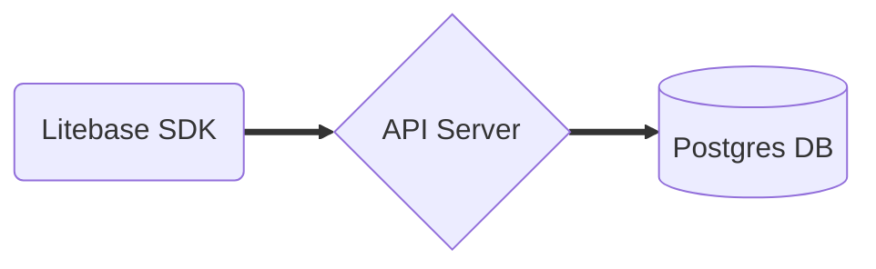

# Litebase

A lightweight alternative to Firebase and Supabase. Self-hosted, open-source Backend-as-a-Service.

## Features

- 🚀 Instant API
- 📦 Real-time Subscriptions
- 🔒 Authentication & Authorization
- 🎯 Type-safe SDK
- 📱 Admin Dashboard
- 🛠 Self-hosted

## Quick Start

### Option 1: Docker Compose (Recommended)

```bash
# Clone the repository
git clone https://github.com/kmal808/litebase
cd litebase

# Configure environment
cp .env.example .env
# Edit .env with your settings

# Start services
docker compose up -d
```

Visit `http://localhost:3001` to access the admin dashboard.

### Option 2: NPM Package Only

```bash
npm install @kvrt/litebase-client-sdk
```

```typescript
import { LitebaseClient } from '@kvrt/litebase-client-sdk'

const client = new LitebaseClient({
  apiKey: 'your-api-key',
  projectId: 'your-project-id',
})

// Initialize and connect for real-time features
await client.connect()

// Create a table
await client.createTable('tasks', {
  id: { type: 'uuid', primary: true },
  title: { type: 'string' },
  status: { type: 'string' },
  created_at: { type: 'timestamp', default: 'now()' },
})

// Insert data
const [task] = await client.insert('tasks', [
  {
    title: 'My first task',
    status: 'pending',
  },
])

// Query data
const tasks = await client.query('tasks', {
  orderBy: { created_at: 'desc' },
})

// Subscribe to real-time updates
const unsubscribe = client.subscribe('tasks', (event) => {
  console.log('Task updated:', event.data)
})

// Cleanup subscription when done
unsubscribe()
```

## Architecture



## Development

```bash
# Install dependencies
npm install

# Start development server
npm run dev

# Run tests
npm test

# Build for production
npm run build
```

## Deployment

### Self-hosted

1. Clone the repository
2. Configure environment variables
3. Run with Docker Compose
4. (Optional) Set up reverse proxy with Nginx/Caddy


## Documentation

- [Getting Started](./docs/getting-started.md)
- [API Reference](./docs/api-reference.md)
- [SDK Documentation](./docs/sdk.md)
- [Deployment Guide](./docs/deployment.md)
- [Examples](./examples)

## Contributing

1. Fork the repository
2. Create your feature branch
3. Commit your changes
4. Push to the branch
5. Create a Pull Request

## License

MIT
